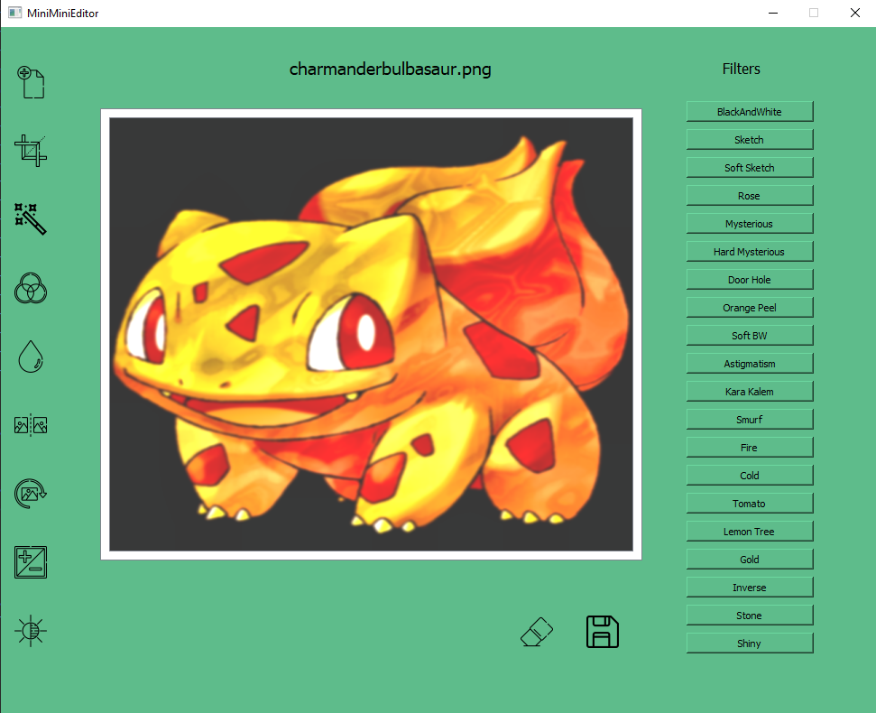

# Versions of library was used in project
  <table>
  <tr>  
    <td> Python </td>
    <td> 3.5 </td>
    </tr>
    <tr>
      <td> NumPy</td>
      <td> 1.19.5 </td>
    </tr>
    <tr>
      <td> OpenCV </td>
      <td> 4.0.1 </td>
  </tr>
  <tr>
    <td>PyQt5</td>
    <td>5.</td>
  </tr>
  </table>

# SimpleImageEditor
It's totally basic image editor. Allow to basic operations such as crop,rotate,flip etc. Also there are some filters. All codes typed from scratch in python and by helping OpenCV. If you use any file or get inspiration from them, please don't forget cite.

<b>Project Video: <a href="https://www.youtube.com/watch?v=jw4T7MEQgBg&amp%3Bab_channel=%C3%9CmitSar%C4%B1%C3%B6z">Click. </a></b>
